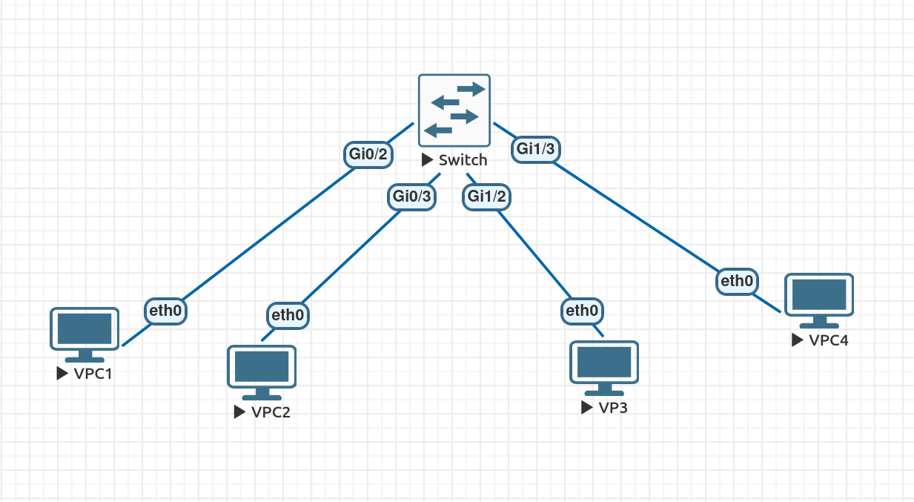
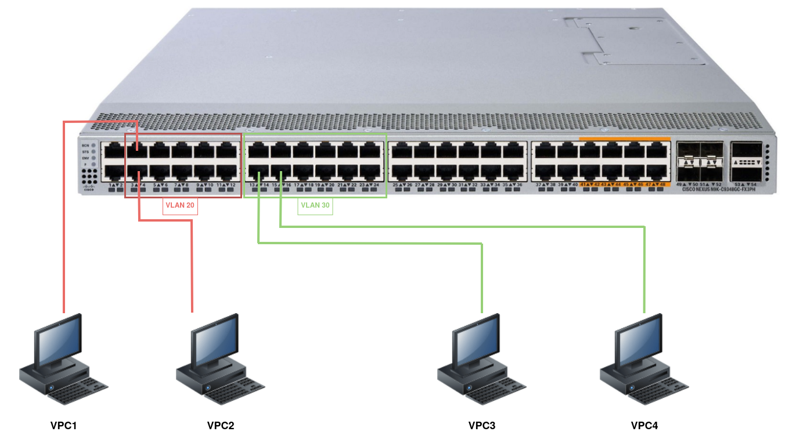
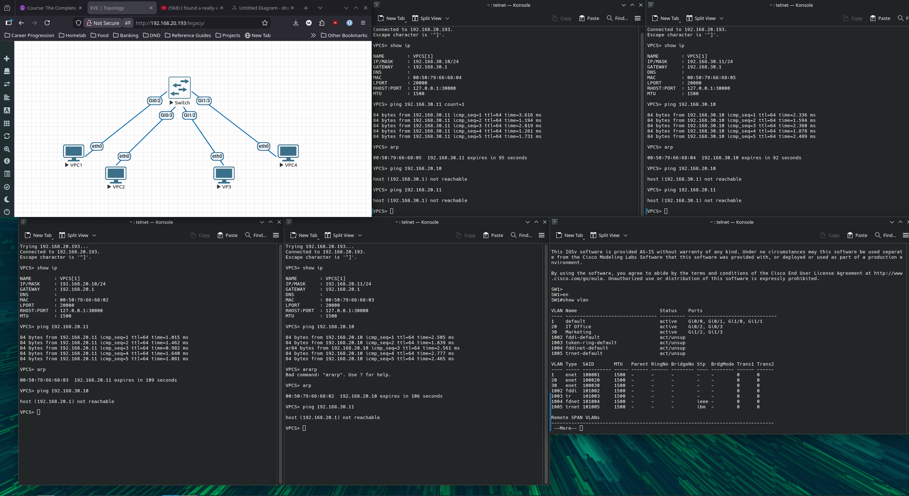

# Lab 1: Basic VLANs (Access Ports)

## Objective
Configure VLANs on a Cisco switch to logically separate network traffic between different departments.

## Date Completed
2025-12-14

## Topology

### Logical Topology


### Example Physical Topology


## Equipment Used
- 1x Cisco vIOS L2 Switch
- 4x Virtual PCs (VPCs)
- EVE-NG virtual lab environment

## VLANs

| VLAN ID | Description |
| ------- | ----------- |
| 20      | IT Office   |
| 30      | Marketing   |

## IP Addressing

| Device | VLAN | IP Address      | Gateway       |
|--------|------|-----------------|---------------|
| VPC1   | 20   | 192.168.20.10/24| 192.168.20.1  |
| VPC2   | 20   | 192.168.20.11/24| 192.168.20.1  |
| VPC3   | 30   | 192.168.30.10/24| 192.168.30.1  |
| VPC4   | 30   | 192.168.30.11/24| 192.168.30.1  |

## Configuration Steps

### Step 1: Switch Setup
```cisco
enable
configure terminal
hostname SW1
```

### Step 2: Creating VLANs
```cisco
vlan 20
name IT Office
vlan 30
name Marketing
exit
```

### Step 3: Assign Ports to VLANs
```cisco
int g0/2
switchport mode access
switchport access vlan 20
int g0/3
switchport mode access
switchport access vlan 20

int g1/2
switchport mode access
switchport access vlan 30
int g1/3
switchport mode access
switchport access vlan 30
exit
```

### Step 4: Save Configuration
```cisco
write
```

## Verification Commands

### Verify VLANs Created
```cisco
Switch# show vlan brief

VLAN Name                             Status    Ports
---- -------------------------------- --------- -------------------------------
1    default                          active    Gi0/0, Gi0/1, Gi1/0, Gi1/1
20   IT Office                        active    Gi0/2, Gi0/3
30   Marketing                        active    Gi1/2, Gi1/3
```

### Verify Port Assignments
```cisco
SW1#  show int status

Port      Name               Status       Vlan       Duplex  Speed Type
Gi0/0                        connected    1          a-full   auto RJ45
Gi0/1                        connected    1          a-full   auto RJ45
Gi0/2                        connected    20         a-full   auto RJ45
Gi0/3                        connected    20         a-full   auto RJ45
Gi1/0                        connected    1          a-full   auto RJ45
Gi1/1                        connected    1          a-full   auto RJ45
Gi1/2                        connected    30         a-full   auto RJ45
Gi1/3                        connected    30         a-full   auto RJ45
SW1#
```

## Testing & Validation

### Expected Behavior
- ✅ VPC1 can ping VPC2 (same VLAN)
- ✅ VPC3 can ping VPC4 (same VLAN)
- ✅ VPC1 CANNOT ping VPC3 (different VLANs)
- ✅ VPC2 CANNOT ping VPC4 (different VLANs)



## Troubleshooting/What broke
No issues from the Cisco IOS side of the configuration, however a few EVE-NG issues which are worth mentioning.

**Problem:** None of my EVE-NG nodes could be stopped, preventing me from adding interfaces

**Fix:** All my start-up delays were 0, meaning they were rebooting the minute I turned them off.

I resolved this by SSHing into the EVE-NG server, navigating to the lab.unl file (mine was under /opt/unetlab/labs/[LAB NAME])

Took a backup of that file, then edited any "delay="0" to be "delay="5".

Saved the file, rebooted the EVE-NG server and this resolved my issues. 

Came accross the following reddit post during the process, but saw no one provided a fix in 7 years. Added my notes into here: https://www.reddit.com/r/networking/comments/cdllj4/eveng_routersswitches_start_automatically_upon/

**Problem:** My virtual PCs were not saving their IP configs

**Fix:** Realised you have to type write if you want the config saved.

## Common Mistakes to Avoid
- Forgetting to create VLANs before assigning ports
- Not setting `switchport mode access`
- Not saving configuration with `write` or `copy running config startup config`

## Files
- [Switch Configuration](configs/SW1-config.txt)
- [Physical Topology Diagram](diagrams/Lab-01-Physical-Topology-Example.png)
- [Testing Screenshots](diagrams/Lab-01-Final-Testing.png)

## Next Steps
- Lab 2: VLAN Trunking between multiple switches
- Lab 3: VLAN troubleshooting scenarios
- Lab 4: Inter-VLAN routing (router-on-a-stick)
