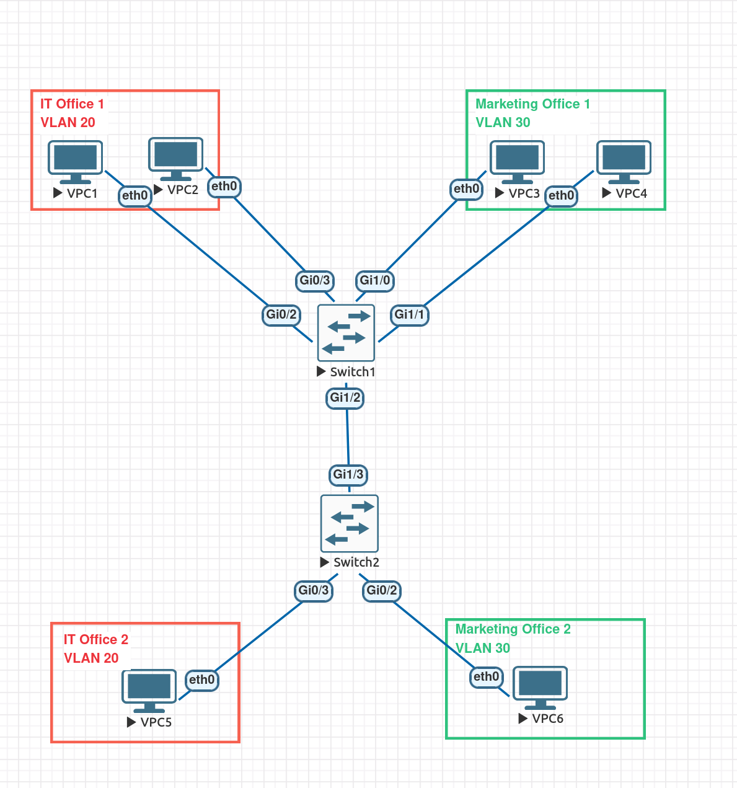
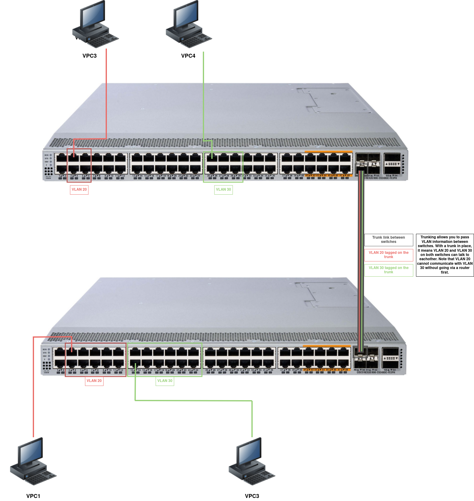
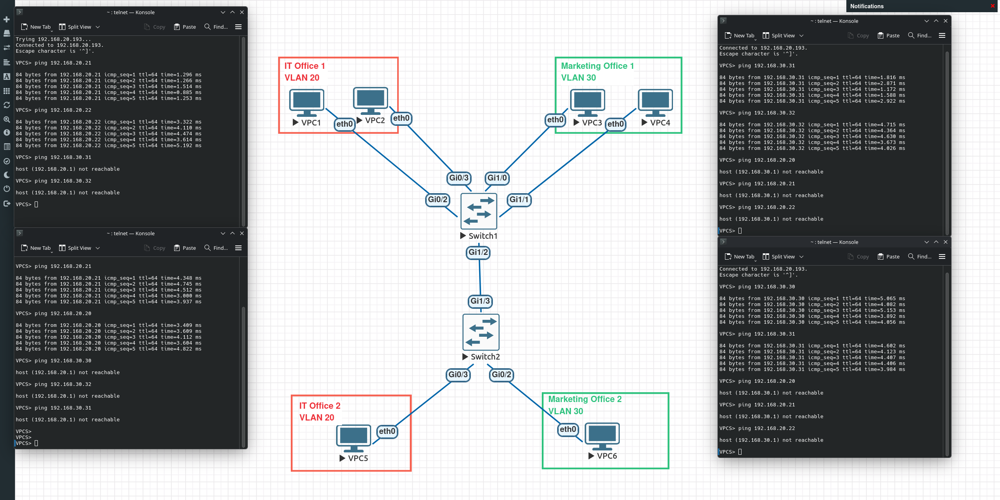

# Lab 2: VLAN Trunking between multiple switches

## Objective
Configure a trunk between two Cisco switches to allow VLAN traffic to be passed between them.

## Date Completed
2025-12-16

## Topology

### Logical Topology


### Physical Topology Example


## Equipment Used
- 2x Cisco vIOS L2 Switch
- 6x Virtual PCs (VPCs)
- EVE-NG virtual lab environment

## VLANs

| VLAN ID | Description |
| ------- | ----------- |
| 20      | IT Office   |
| 30      | Marketing   |

## IP Addressing

| Name | VLAN | IP Address    | Subnet Mask   | Gateway      |
| ---- | ---- | ------------- | ------------- | ------------ |
| VPC1 | 20   | 192.168.20.20 | 255.255.255.0 | 192.168.20.1 |
| VPC2 | 20   | 192.168.20.21 | 255.255.255.0 | 192.168.20.1 |
| VPC5 | 20   | 192.168.20.22 | 255.255.255.0 | 192.168.20.1 |
| VPC3 | 30   | 192.168.30.30 | 255.255.255.0 | 192.168.30.1 |
| VPC4 | 30   | 192.168.30.31 | 255.255.255.0 | 192.168.30.1 |
| VPC6 | 30   | 192.168.30.32 | 255.255.255.0 | 192.168.30.1 |

## Configuration Steps

### Step 1: Switch 1 Setup
```cisco
enable
configure terminal
hostname SW1
```

### Step 2: Creating VLANs
```cisco
vlan 20
name IT Office
vlan 30
name Marketing
exit
```

### Step 3: Assign Ports to VLANs
```cisco
int g0/2
switchport mode access
switchport access vlan 20
int g0/3
switchport mode access
switchport access vlan 20

int g1/0
switchport mode access
switchport access vlan 30
int g1/1
switchport mode access
switchport access vlan 30
exit
```

### Step 4: Create trunk
```cisco
int g1/2
switchport trunk encapsulation dot1q
switchport mode trunk
```

### Step 5: Save Configuration
```cisco
write
```

### Step 6: Switch 2 Setup
```cisco
enable
configure terminal
hostname SW2
```

### Step 7: Creating VLANs
```cisco
vlan 20
name IT Office
vlan 30
name Marketing
exit
```

### Step 8: Assign Ports to VLANs
```cisco
int g0/2
switchport mode access
switchport access vlan 20
int g0/3
switchport mode access
switchport access vlan 30
exit
```

### Step 9: Create trunk
```cisco
int g1/3
switchport trunk encapsulation dot1q
switchport mode trunk
```

### Step 10: Save Configuration
```cisco
write
```

## Verification Commands

### Verify VLANs Created on SW1
```cisco
SW1# show vlan brief

VLAN Name                             Status    Ports
---- -------------------------------- --------- -------------------------------
1    default                          active    Gi0/0, Gi0/1, Gi1/3
20   IT Office                        active    Gi0/2, Gi0/3
30   Marketing                        active    Gi1/0, Gi1/1
```

### Verify VLANs Created on SW1#2
```cisco
SW2# show vlan brief

VLAN Name                             Status    Ports
---- -------------------------------- --------- -------------------------------
1    default                          active    Gi0/0, Gi0/1, Gi1/0, Gi1/1
20   IT Office                        active    Gi0/3
30   Marketing                        active    Gi0/2
```

### Verify Port Assignments on SW1
```cisco
SW1#show int status

Port      Name               Status       Vlan       Duplex  Speed Type
Gi0/0                        connected    1          a-full   auto RJ45
Gi0/1                        connected    1          a-full   auto RJ45
Gi0/2                        connected    20         a-full   auto RJ45
Gi0/3                        connected    20         a-full   auto RJ45
Gi1/0                        connected    30         a-full   auto RJ45
Gi1/1                        connected    30         a-full   auto RJ45
Gi1/2                        connected    trunk      a-full   auto RJ45
Gi1/3                        connected    1          a-full   auto RJ45
SW1#
```

### Verify Port Assignments on SW2
```cisco
SW2#show int status

Port      Name               Status       Vlan       Duplex  Speed Type
Gi0/0                        connected    1          a-full   auto RJ45
Gi0/1                        connected    1          a-full   auto RJ45
Gi0/2                        connected    30         a-full   auto RJ45
Gi0/3                        connected    20         a-full   auto RJ45
Gi1/0                        connected    1          a-full   auto RJ45
Gi1/1                        connected    1          a-full   auto RJ45
Gi1/2                        connected    1          a-full   auto RJ45
Gi1/3                        connected    trunk      a-full   auto RJ45
SW2#
```

## Testing & Validation

### Expected Behavior (without trunk)
- ✅ VPC1 can ping VPC2 (same VLAN)
- ✅ VPC3 can ping VPC4 (same VLAN)
- ✅ VPC1 CANNOT ping VPC3 (different VLAN)
- ✅ VPC2 CANNOT ping VPC4 (different VLAN)
- ✅ VPC1 CANNOT ping VPC5 (same VLAN but no trunk)
- ✅ VPC3 CANNOT ping VPC6 (same VLAN but no trunk)

### Expected Behavior (with trunk)
- ✅ VPC1 can ping VPC2 and VPC5 (same VLAN and across trunk)
- ✅ VPC3 can ping VPC4 and VPC6 (same VLAN and across trunk)



## Troubleshooting/What broke
**Problem:** Could not create a trunk port, error "An interface whose trunk encapsulation is "Auto" can not be configured to "trunk" mode."

**Fix:** After a quick Google, the answer can be found here: https://learningnetwork.cisco.com/s/question/0D53i00000Kt674CAB/command-rejected-an-interface-whose-trunk-encapsulation-is-auto-can-not-be-configured-to-trunk-mode

I needed to first set the encapsulation mode with:
```cisco
switchport trunk encapsulation [dot1q | isl]
```
Then I could set the trunk.

**Why dot1q?**
- 802.1Q (dot1q) is the modern standard
- ISL is Cisco legacy (deprecated)
- Always use dot1q unless you have ancient equipment

## Common Mistakes to Avoid
- Not setting the encapsulation mode before creating the trunk

## Files
- [Switch 1 Configuration](configs/SW1-config.txt)
- [Switch 2 Configuration](configs/SW2-config.txt)
- [Physical Topology Example Diagram](diagrams/Lab-02-Physical-Topology-Example.png)
- [Quick Testing Screenshot 1](diagrams/Lab-02-Quick-Testing.png)
- [Quick Testing Screenshot 2](diagrams/Lab-02-Quick-Testing-2.png)
- [Final Trunk and Lab Testing Screenshot](diagrams/Lab-02-Trunk-Testing.png)

## What I Learned

### Technical Concepts
- **Trunk ports carry multiple VLANs** using 802.1Q tagging
- **VLANs must exist on both switches** for trunk to pass traffic
- **Encapsulation must be set before trunk mode** on some platforms
- **Native VLAN** (VLAN 1 by default) carries untagged traffic on trunk

### Troubleshooting
- Check `show interfaces trunk` to verify trunk is actually trunking
- Encapsulation error means you need `switchport trunk encapsulation dot1q` first
- Test both directions (VLAN 20 across trunk AND VLAN 30 across trunk)

### Key Commands
- `show interfaces trunk` - Verifying trunk operation
- `show vlan brief` - Quick check of VLAN-to-port assignments
- `show interfaces status` - See which ports are in trunk mode vs access mode

- ## Time to Complete
- Topology setup: 20 minutes
- Configuration: 30 minutes
- Testing and troubleshooting: 25 minutes
- Documentation: 45 minutes
- **Total: ~2 hours**

## Next Steps
- Lab 3: VLAN troubleshooting scenarios
- Lab 4: Inter-VLAN routing (router-on-a-stick)
